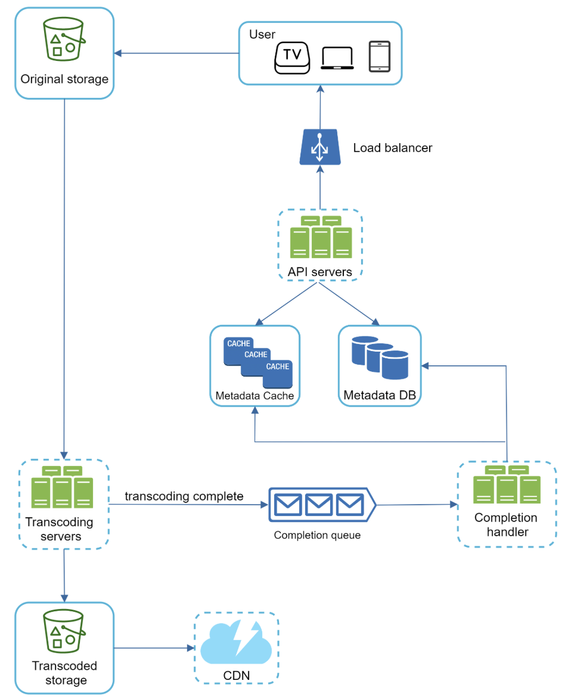

# Plan for implementing this video streaming service

## Components

- Frontend: nothing crazy here, TS + React.
- API: Go with Gin.
- Infra: Kubernetes, ArgoCD, Istio
- Extras: ffmpeg, redis, CDN.

## Architecture

## Tasks

### Phase 1. No caching, no transcoding, the most basic setup

[ ] API endpoint to set metadata
[ ] Set up MongoDB for metadata
[ ] Set up CDN for video streaming
[ ] Simple website that allows to upload and watch the video 

### Phase 2. Add caching, transcoding

[ ] Add metadata cache
[ ] Add transcoding

## Resources

- https://bytebytego.com/courses/system-design-interview/design-youtube
